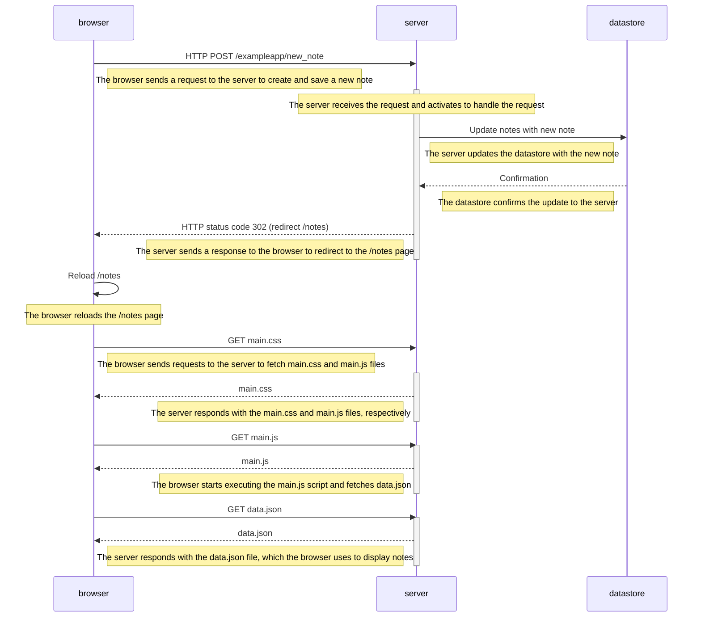

```mermaid
sequenceDiagram

    participant browser
    participant server
    participant datastore

    browser->>server: HTTP POST /exampleapp/new_note
    Note right of browser: The browser sends a request to the server to create and save a new note
    activate server
    Note over server: The server receives the request and activates to handle the request
    server->>datastore: Update notes with new note
    Note right of server: The server updates the datastore with the new note
    datastore-->>server: Confirmation
    Note left of datastore: The datastore confirms the update to the server
    server-->>browser: HTTP status code 302 (redirect /notes)
    Note left of server: The server sends a response to the browser to redirect to the /notes page
    deactivate server
    browser->>browser: Reload /notes
    Note over browser: The browser reloads the /notes page
    browser->>server: GET main.css
    Note right of browser: The browser sends requests to the server to fetch main.css and main.js files
    activate server
    server-->>browser: main.css
    Note left of server: The server responds with the main.css and main.js files, respectively
    deactivate server
    browser->>server: GET main.js
    activate server
    server-->>browser: main.js
    Note left of server: The browser starts executing the main.js script and fetches data.json
    deactivate server
    browser->>server: GET data.json
    activate server
    server-->>browser: data.json
    Note left of server: The server responds with the data.json file, which the browser uses to display notes
    deactivate server
```
