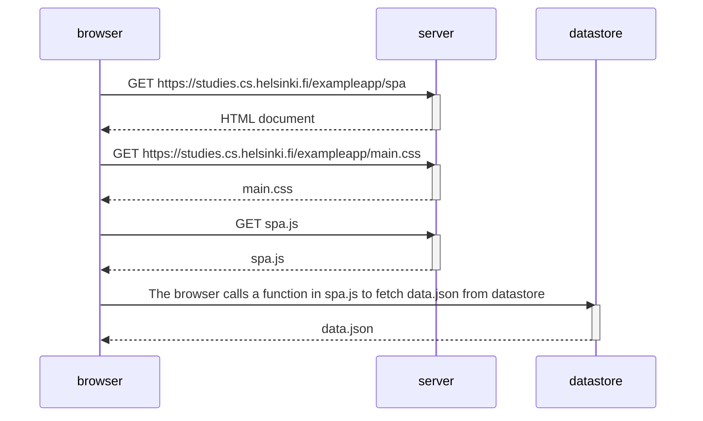

```mermaid
sequenceDiagram
    participant browser
    participant server
    participant datastore

    browser->>server: GET https://studies.cs.helsinki.fi/exampleapp/spa
    activate server
    server-->>browser: HTML document
    deactivate server
    browser->>server: GET https://studies.cs.helsinki.fi/exampleapp/main.css
    activate server
    server-->>browser: main.css
    deactivate server
    browser->>server: GET spa.js
    activate server
    server-->>browser: spa.js
    deactivate server
    browser->>datastore: The browser calls a function in spa.js to fetch data.json from datastore
    activate datastore
    datastore-->>browser: data.json
    deactivate datastore
```
