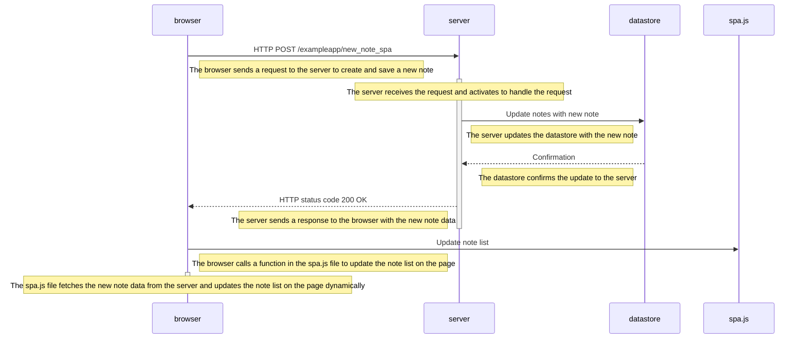

```mermaid
sequenceDiagram

    participant browser
    participant server
    participant datastore

    browser->>server: HTTP POST /exampleapp/new_note_spa
    Note right of browser: The browser sends a request to the server to create and save a new note
    activate server
    Note over server: The server receives the request and activates to handle the request
    server->>datastore: Update notes with new note
    Note right of server: The server updates the datastore with the new note
    datastore-->>server: Confirmation
    Note left of datastore: The datastore confirms the update to the server
    server-->>browser: HTTP status code 200 OK
    Note left of server: The server sends a response to the browser with the new note data
    deactivate server
    browser->>spa.js: Update note list
    Note right of browser: The browser calls a function in the spa.js file to update the note list on the page
    activate browser
    Note over browser: The spa.js file fetches the new note data from the server and updates the note list on the page dynamically
    deactivate browser
```
